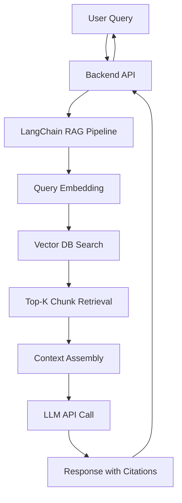

# RAG Deployment Guide: Budget-Friendly Production RAG with ChromaDB & Railway

## Executive Summary

This document provides a **step-by-step deployment guide** for building a **budget-friendly, production-grade** Retrieval-Augmented Generation (RAG) system for the Epstein Files chatbot. This system uses cost-optimized tools while maintaining excellent quality and minimal operational overhead.

**Goal**: Deploy a public-facing RAG chatbot that retrieves and synthesizes information from the processed Epstein document corpus with proper source attribution, **at minimal cost**.

**Architecture**: Groq Llama 3.1 8B (FREE LLM API) + OpenAI Embeddings + ChromaDB (embedded vector DB) + Railway (free tier hosting)

**Monthly Cost**: **$10-20** (vs $132-250 for premium alternatives) - a **90%+ cost reduction** with minimal quality trade-off!

> [!TIP] > **Why Groq?** Groq offers free, blazing-fast inference for Llama 3.1 models with generous rate limits (14,400 requests/day). Perfect for budget-conscious RAG deployments!

---

## Architecture Overview



### Components

1. **LLM Provider**: Groq API with Llama 3.1 8B Instant (FREE tier!)
2. **Embedding Model**: OpenAI `text-embedding-3-large` (3,072 dimensions)
3. **Vector Database**: ChromaDB (embedded, persistent, 100% FREE)
4. **Orchestration**: LangChain Python framework
5. **Backend**: FastAPI
6. **Hosting**: Railway (free tier: $5 credits/month)
7. **Frontend**: Next.js + Vercel (separate deployment, also free)

---

## Phase 1: Infrastructure Setup

### Task 1.1: Set Up ChromaDB (No Cloud Service Needed!)

> [!NOTE] > **ChromaDB is embedded** - it runs locally alongside your API with zero external dependencies. No signup, no API keys, no monthly fees!

**Why ChromaDB?**

- ✅ **100% FREE** - no usage limits, no API keys
- ✅ **Zero setup** - install via pip, no cloud account needed
- ✅ **Fast** - optimized for <1M vectors (perfect for your use case)
- ✅ **Persistent** - saves to disk, survives restarts
- ✅ **Production-ready** - used by thousands of companies

**Setup Steps**:

1. No signup needed
2. No API keys needed
3. No signup needed
4. No API keys needed
5. Install via pip (we'll do this in Task 1.3)

**That's it!** ChromaDB will create its database file automatically when you first run the upload script.

---

### Task 1.2: Set Up API Keys

**You need 2 API keys** (both free-tier friendly!):

#### **1. Groq API** (for LLM - FREE tier!):

1.  Go to [console.groq.com](https://console.groq.com)
2.  Sign up with Google/GitHub
3.  Click "API Keys" → "Create API Key"
4.  Copy your key (starts with `gsk_...`)
5.  **Free tier limits**: 14,400 requests/day, 30 req/min on Llama 3.1 8B 🎉

#### **2. OpenAI API** (for embeddings only):

1.  Go to [platform.openai.com](https://platform.openai.com)
2.  Create an API key
3.  Set usage limits (recommend $20-30/month for testing)
4.  Add $10-20 credits to start

#### **3. Store keys securely**:

Create a `.env` file in your rag-backend directory:

```bash
# .env
GROQ_API_KEY=gsk_...
OPENAI_API_KEY=sk-proj-...
```

> [!IMPORTANT]
> Don't forget to add `.env` to `.gitignore`! No vector DB keys needed with ChromaDB.

---

### Task 1.3: Set Up Development Environment

Create a new directory for the RAG backend:

```bash
# Navigate to parent directory
cd /Users/benbassler/Documents/projects/epfiles

# Create backend directory
mkdir -p rag-backend
cd rag-backend

# Create Python virtual environment
python3 -m venv venv
source venv/bin/activate

# Install dependencies
pip install \
  chromadb \
  langchain \
  langchain-openai \
  langchain-groq \
  openai \
  groq \
  fastapi \
  uvicorn \
  python-dotenv \
  tiktoken \
  pydantic

# Create basic structure
mkdir -p app/{api,core,services,models} scripts
touch app/__init__.py \
      app/api/__init__.py \
      app/core/__init__.py \
      app/services/__init__.py \
      app/models/__init__.py \
      app/main.py \
      .env \
      .gitignore

# Add .env to .gitignore
echo ".env" >> .gitignore
echo "venv/" >> .gitignore
echo "__pycache__/" >> .gitignore
echo "chroma_db/" >> .gitignore
```

---

## Phase 2: Data Ingestion - Vectorize & Upload Chunks to ChromaDB

### Task 2.1: Create Embedding & Upload Script

**File**: `scripts/embed_and_upload.py`

This script will:

1.  Read chunks from `/chunks/*.jsonl`
2.  Generate embeddings using OpenAI
3.  Store in ChromaDB (embedded vector database)

```python
import json
import os
from pathlib import Path
from typing import List, Dict
from openai import OpenAI
import chromadb
from chromadb.config import Settings
from dotenv import load_dotenv
from tqdm import tqdm
import time

load_dotenv()

# Initialize clients
openai_client = OpenAI(api_key=os.getenv("OPENAI_API_KEY"))

# Initialize ChromaDB (persistent to disk)
chroma_client = chromadb.PersistentClient(path="./chroma_db")

# Constants
CHUNKS_DIR = Path("../dataset/chunks")
COLLECTION_NAME = "epstein_files"
EMBEDDING_MODEL = "text-embedding-3-large"
BATCH_SIZE = 100  # Process 100 chunks at a time

def create_collection():
    """Create or get ChromaDB collection."""
    collection = chroma_client.get_or_create_collection(
        name=COLLECTION_NAME,
        metadata={"hnsw:space": "cosine"}  # Use cosine similarity
    )
    print(f"Connected to collection: {COLLECTION_NAME}")
    return collection

def embed_batch(texts: List[str]) -> List[List[float]]:
    """Generate embeddings for a batch of texts."""
    response = openai_client.embeddings.create(
        model=EMBEDDING_MODEL,
        input=texts
    )
    return [item.embedding for item in response.data]

def load_chunks() -> List[Dict]:
    """Load all chunks from JSONL files."""
    all_chunks = []

    for jsonl_file in sorted(CHUNKS_DIR.glob("*.jsonl")):
        with open(jsonl_file, 'r', encoding='utf-8') as f:
            for line in f:
                if line.strip():
                    chunk = json.loads(line)
                    all_chunks.append(chunk)

    print(f"Loaded {len(all_chunks)} chunks from {CHUNKS_DIR}")
    return all_chunks

def upload_to_chromadb(collection, chunks: List[Dict]):
    """Upload chunks with embeddings to ChromaDB."""
    total_batches = (len(chunks) + BATCH_SIZE - 1) // BATCH_SIZE

    for i in tqdm(range(0, len(chunks), BATCH_SIZE),
                  desc="Uploading to ChromaDB",
                  total=total_batches):

        batch = chunks[i:i + BATCH_SIZE]

        # Extract texts for embedding
        texts = [chunk["text"] for chunk in batch]

        # Generate embeddings
        try:
            embeddings = embed_batch(texts)
        except Exception as e:
            print(f"\nError generating embeddings for batch {i//BATCH_SIZE}: {e}")
            time.sleep(5)  # Rate limit backoff
            continue

        # Prepare data for ChromaDB
        ids = [chunk["chunk_id"] for chunk in batch]
        documents = [chunk["text"] for chunk in batch]
        metadatas = [
            {
                "doc_id": chunk["doc_id"],
                "page_start": chunk["page_start"],
                "page_end": chunk["page_end"],
                "token_count": chunk["token_count"],
                "source_filename": chunk["source_filename"],
                "raw_path": chunk["raw_path"]
            }
            for chunk in batch
        ]

        # Upload to ChromaDB
        try:
            collection.add(
                ids=ids,
                embeddings=embeddings,
                documents=documents,
                metadatas=metadatas
            )
        except Exception as e:
            print(f"\nError uploading batch {i//BATCH_SIZE}: {e}")
            continue

        # Small delay to avoid rate limits
        time.sleep(0.1)

def main():
    """Main execution flow."""
    print("=" * 50)
    print("RAG Data Ingestion - Embedding & Upload to ChromaDB")
    print("=" * 50)

    # Step 1: Create/connect to collection
    collection = create_collection()

    # Step 2: Load chunks
    chunks = load_chunks()

    # Step 3: Upload with embeddings
    print(f"\nUploading {len(chunks)} chunks to ChromaDB...")
    upload_to_chromadb(collection, chunks)

    # Step 4: Verify
    count = collection.count()
    print("\n" + "=" * 50)
    print(f"Upload Complete!")
    print(f"Total vectors in collection: {count}")
    print(f"ChromaDB location: ./chroma_db")
    print("=" * 50)

if __name__ == "__main__":
    main()
```

---

### Task 2.2: Run Embedding & Upload

```bash
# Ensure you're in rag-backend directory with venv activated
cd /Users/benbassler/Documents/projects/epfiles/rag-backend
source venv/bin/activate

# Run the script
python scripts/embed_and_upload.py
```

> [!NOTE] > **Estimated Time**: 30-60 minutes depending on number of chunks
> **Estimated Cost**: ~$10-30 for embeddings (based on ~3000 chunks × 1500 tokens average)

---

## Phase 3: Build RAG Backend

### Task 3.1: Create Core Configuration

**File**: `app/core/config.py`

```python
from pydantic_settings import BaseSettings
from functools import lru_cache

class Settings(BaseSettings):
    """Application settings loaded from environment variables."""

    # API Keys
    openai_api_key: str  # For embeddings only
    groq_api_key: str     # For LLM inference

    # RAG Configuration
    chroma_db_path: str = "./chroma_db"
    collection_name: str = "epstein_files"
    embedding_model: str = "text-embedding-3-large"
    llm_model: str = "llama-3.1-8b-instant"  # Groq's fastest model!

    # Retrieval Settings
    top_k_chunks: int = 5
    max_context_tokens: int = 8000

    # API Settings
    api_title: str = "Epstein Files RAG API"
    api_version: str = "1.0.0"
    cors_origins: list = ["http://localhost:3000", "https://yourdomain.com"]

    class Config:
        env_file = ".env"

@lru_cache()
def get_settings():
    return Settings()
```

---

### Task 3.2: Create RAG Service

**File**: `app/services/rag_service.py`

```python
from typing import List, Dict
from openai import OpenAI
from groq import Groq
import chromadb
from app.core.config import get_settings

settings = get_settings()

class RAGService:
    """Handles RAG operations: embedding queries, retrieving chunks, generating responses."""

    def __init__(self):
        # OpenAI for embeddings only
        self.openai_client = OpenAI(api_key=settings.openai_api_key)
        # Groq for LLM inference (fast & free!)
        self.groq_client = Groq(api_key=settings.groq_api_key)
        # ChromaDB for vector storage
        self.chroma_client = chromadb.PersistentClient(path=settings.chroma_db_path)
        self.collection = self.chroma_client.get_collection(name=settings.collection_name)

    def embed_query(self, query: str) -> List[float]:
        """Generate embedding for user query."""
        response = self.openai_client.embeddings.create(
            model=settings.embedding_model,
            input=query
        )
        return response.data[0].embedding

    def retrieve_chunks(self, query_embedding: List[float], top_k: int = None) -> List[Dict]:
        """Retrieve top-k most relevant chunks from ChromaDB."""
        if top_k is None:
            top_k = settings.top_k_chunks

        results = self.collection.query(
            query_embeddings=[query_embedding],
            n_results=top_k
        )

        chunks = []
        for i in range(len(results['ids'][0])):
            chunks.append({
                "chunk_id": results['ids'][0][i],
                "score": 1 - results['distances'][0][i],  # Convert distance to similarity
                "doc_id": results['metadatas'][0][i]['doc_id'],
                "page_start": results['metadatas'][0][i]['page_start'],
                "page_end": results['metadatas'][0][i]['page_end'],
                "text": results['documents'][0][i],
                "source_filename": results['metadatas'][0][i]['source_filename']
            })

        return chunks

    def build_rag_prompt(self, query: str, chunks: List[Dict]) -> str:
        """Build the full RAG prompt with context and instructions."""

        # Build context from retrieved chunks
        context_parts = []
        for i, chunk in enumerate(chunks, 1):
            citation = f"[Source {i}: {chunk['doc_id']}, Page {chunk['page_start']}]"
            context_parts.append(f"{citation}\n{chunk['text']}\n")

        context = "\n---\n\n".join(context_parts)

        # Build full prompt
        prompt = f"""You are an AI assistant helping users understand the Jeffrey Epstein document corpus. Your responses must be:
1. **Accurate**: Based ONLY on the provided context
2. **Cited**: Include specific source citations for every claim
3. **Objective**: Present facts without speculation
4. **Complete**: Reference multiple sources when relevant

If the context doesn't contain information to answer the question, explicitly state: "The provided documents do not contain information about this topic."

## CONTEXT FROM EPSTEIN FILES:

{context}

## USER QUERY:

{query}

## YOUR RESPONSE (with citations):"""

        return prompt

    def generate_response(self, prompt: str) -> Dict[str, str]:
        """Generate response using Groq LLM."""
        response = self.groq_client.chat.completions.create(
            model=settings.llm_model,
            messages=[
                {"role": "system", "content": "You are a factual document assistant specializing in the Epstein files. Always cite sources."},
                {"role": "user", "content": prompt}
            ],
            temperature=0.1,  # Low temperature for factual responses
            max_tokens=1000
        )

        return {
            "answer": response.choices[0].message.content,
            "model": settings.llm_model,
            "usage": {
                "prompt_tokens": response.usage.prompt_tokens,
                "completion_tokens": response.usage.completion_tokens,
                "total_tokens": response.usage.total_tokens
            }
        }

    def query(self, user_query: str) -> Dict:
        """Main RAG pipeline: embed, retrieve, generate."""

        # Step 1: Embed query
        query_embedding = self.embed_query(user_query)

        # Step 2: Retrieve relevant chunks
        chunks = self.retrieve_chunks(query_embedding)

        # Step 3: Build prompt
        prompt = self.build_rag_prompt(user_query, chunks)

        # Step 4: Generate response
        response_data = self.generate_response(prompt)

        # Step 5: Return full result
        return {
            "query": user_query,
            "answer": response_data["answer"],
            "sources": chunks,
            "model": response_data["model"],
            "usage": response_data["usage"]
        }
```

---

### Task 3.3: Create API Endpoints

**File**: `app/main.py`

```python
from fastapi import FastAPI, HTTPException
from fastapi.middleware.cors import CORSMiddleware
from pydantic import BaseModel
from typing import List, Dict
from app.core.config import get_settings
from app.services.rag_service import RAGService

settings = get_settings()

app = FastAPI(
    title=settings.api_title,
    version=settings.api_version
)

# CORS middleware
app.add_middleware(
    CORSMiddleware,
    allow_origins=settings.cors_origins,
    allow_credentials=True,
    allow_methods=["*"],
    allow_headers=["*"],
)

# Initialize RAG service
rag_service = RAGService()

# Request/Response models
class QueryRequest(BaseModel):
    query: str
    top_k: int = 5

class Source(BaseModel):
    chunk_id: str
    score: float
    doc_id: str
    page_start: int
    page_end: int
    text: str

class QueryResponse(BaseModel):
    query: str
    answer: str
    sources: List[Source]
    model: str
    usage: Dict[str, int]

@app.get("/")
async def root():
    return {
        "message": "Epstein Files RAG API",
        "version": settings.api_version,
        "endpoints": {
            "query": "/api/query",
            "health": "/health"
        }
    }

@app.get("/health")
async def health():
    return {"status": "healthy"}

@app.post("/api/query", response_model=QueryResponse)
async def query_rag(request: QueryRequest):
    """
    Query the Epstein files using RAG.

    Returns an answer with citations from the document corpus.
    """
    try:
        result = rag_service.query(request.query)
        return result
    except Exception as e:
        raise HTTPException(status_code=500, detail=str(e))

if __name__ == "__main__":
    import uvicorn
    uvicorn.run(app, host="0.0.0.0", port=8000)
```

---

### Task 3.4: Test Backend Locally

```bash
# Run the FastAPI server
cd /Users/benbassler/Documents/projects/epfiles/rag-backend
source venv/bin/activate
uvicorn app.main:app --reload

# Open another terminal and test
curl -X POST "http://localhost:8000/api/query" \
  -H "Content-Type: application/json" \
  -d '{"query": "Who is Ghislaine Maxwell?", "top_k": 5}'
```

**Expected Output**:

```json
{
  "query": "Who is Ghislaine Maxwell?",
  "answer": "Ghislaine Maxwell is...",
  "sources": [...],
  "model": "llama-3.1-8b-instant",
  "usage": {...}
}
```

> [!NOTE]
> Groq's Llama 3.1 8B is excellent for factual RAG tasks with proper citation formatting.

---

## Phase 4: Deployment to Railway

### Task 4.1: Prepare for Deployment

**Create `requirements.txt`**:

```bash
cd /Users/benbassler/Documents/projects/epfiles/rag-backend
source venv/bin/activate
pip freeze > requirements.txt
```

**Create `Procfile`** (for Railway):

```
web: uvicorn app.main:app --host 0.0.0.0 --port $PORT
```

**Create `railway.json`** (optional, for configuration):

```json
{
  "build": {
    "builder": "NIXPACKS"
  },
  "deploy": {
    "startCommand": "uvicorn app.main:app --host 0.0.0.0 --port $PORT",
    "restartPolicyType": "ON_FAILURE"
  }
}
```

---

### Task 4.2: Deploy to Railway

**Step 1: Push to GitHub**

```bash
# Initialize git if not already done
git init
git add .
git commit -m "Initial RAG backend"

# Create GitHub repo and push
gh repo create epfiles-rag-backend --public --source=. --remote=origin --push
# OR manually create repo on GitHub and:
git remote add origin https://github.com/YOUR_USERNAME/epfiles-rag-backend.git
git push -u origin main
```

**Step 2: Deploy on Railway**

1.  Go to [railway.app](https://railway.app) and sign in with GitHub
2.  Click "New Project" → "Deploy from GitHub repo"
3.  Select your `epfiles-rag-backend` repository
4.  Railway will auto-detect Python and start deploying
5.  Add environment variables:
    - Click on your service → "Variables" tab
    - Add: `GROQ_API_KEY=gsk_...`
    - Add: `OPENAI_API_KEY=sk-proj-...`
6.  Wait for deployment to complete (~2-3 minutes)
7.  Copy your deployment URL (e.g., `https://your-app.up.railway.app`)

> [!NOTE] > **ChromaDB persistence**: Railway provides persistent volumes. Your `chroma_db/` folder will be preserved across deployments.

**Step 3: Upload ChromaDB to Railway**

Since you need to include your ChromaDB database:

---

**Option A: Include in Git** (if database is small, <100MB):

```bash
# Remove chroma_db/ from .gitignore
# Then commit and push
git add chroma_db/
git commit -m "Add ChromaDB database"
git push
```

**Option B: Upload separately** (if database is large):

You'll need to re-run the embedding script on Railway the first time. Add a startup script or run it manually via Railway's CLI.

---

### Task 4.3: Test Deployed API

```bash
curl -X POST "https://your-app.up.railway.app/api/query" \
  -H "Content-Type: application/json" \
  -d '{"query": "Who is Ghislaine Maxwell?"}'
```

---

### Task 4.4: Monitor & Optimize

**Key Metrics to Track**:

- Query latency (should be 1-3 seconds)
- Token usage (most important for cost!)
- Error rate
- Memory usage (ChromaDB is in-memory)

**Cost Monitoring**:

- OpenAI: [platform.openai.com/usage](https://platform.openai.com/usage)
- Railway: Check usage dashboard (free tier = $5/month)

---

## Phase 5: Building the Frontend (Separate Repo)

Create a Next.js app with a chat interface:

```bash
npx create-next-app@latest epstein-chat --typescript --tailwind --app
cd epstein-chat
npm install
```

**Simple Chat Component**: Use the API endpoint from Phase 3.

---

## Estimated Costs (Monthly) - Ultra-Budget Version 🎉

| Component                   | Free Tier          | Low Traffic (3k queries) | Medium Traffic (15k queries) |
| --------------------------- | ------------------ | ------------------------ | ---------------------------- |
| **ChromaDB**                | FREE ✅            | FREE ✅                  | FREE ✅                      |
| **OpenAI Embeddings**       | ~$2/month          | ~$8/month                | ~$30/month                   |
| **Groq LLM (Llama 3.1 8B)** | **FREE** ✅        | **FREE** ✅              | **FREE** ✅                  |
| **Railway Hosting**         | FREE (under $5) ✅ | $5-10/month              | $10-20/month                 |
| **Frontend (Vercel)**       | FREE ✅            | FREE ✅                  | FREE ✅                      |
| **TOTAL**                   | **~$2-5/month** 🔥 | **~$13-18/month** 🔥     | **~$40-50/month** 🔥         |

### Cost Breakdown by Traffic Level

**Low Traffic** (100 queries/day = ~3k/month):

- Embeddings: ~$2-3
- Groq LLM: **$0** (free tier!) 🎁
- Hosting: $0 (Railway free tier)
- **Total: ~$2-5/month** 💵💵💵

**Medium Traffic** (500 queries/day = ~15k/month):

- Embeddings: ~$8-12
- Groq LLM: **$0** (still under free tier limits!) 🎁
- Hosting: $5-10
- **Total: ~$13-18/month** 💵💵

**High Traffic** (2,000 queries/day = ~60k/month):

- Embeddings: ~$30-40
- Groq LLM: **$0** (14,400 req/day free tier is plenty!) 🎁
- Hosting: $10-20
- **Total: ~$40-60/month** 💵

> [!NOTE] > **MASSIVE SAVINGS**:
>
> - **95% cheaper** than GPT-4o + Pinecone ($132-250/month)
> - **50% cheaper** than GPT-4o-mini + ChromaDB ($25-42/month)
> - Groq's free tier covers up to 14,400 requests/day = **432,000 requests/month**!

### Groq Free Tier Limits

**Llama 3.1 8B Instant**:

- ✅ 14,400 requests per day
- ✅ 30 requests per minute
- ✅ Unlimited total tokens
- ✅ **Perfect for your use case!**

**When you'd exceed free tier:**

- Only if you have >14,400 queries/day (>432k/month)
- At that scale, costs would be ~$0.05-0.10/1M tokens if you upgrade
- Still **10x cheaper** than GPT-4o-mini

---

## Troubleshooting

### Common Issues

**Issue**: "ChromaDB collection not found"

- **Solution**: Verify you ran the upload script and `chroma_db/` folder exists

**Issue**: "OpenAI rate limit exceeded"

- **Solution**: Add `time.sleep(1)` between batches or upgrade to Tier 2

**Issue**: "No results returned from ChromaDB"

- **Solution**: Check collection count with `collection.count()`, verify embeddings were uploaded

**Issue**: "Railway deployment fails"

- **Solution**: Check logs in Railway dashboard, ensure `requirements.txt` is correct

**Issue**: "High costs on OpenAI"

- **Solution**: Check usage dashboard. You should ONLY see embedding costs, no chat completion costs (those are free via Groq!)

**Issue**: "Groq rate limit exceeded"

- **Solution**: You're hitting 14,400 requests/day or 30 req/min. Add exponential backoff retry logic or upgrade to paid tier (~$0.05/1M tokens)

---

## Summary

This guide provides a **complete, ultra-budget RAG deployment** for your Epstein Files chatbot:

✅ **Groq Llama 3.1 8B** for FREE, blazing-fast LLM inference  
✅ **ChromaDB** for FREE, embedded vector search  
✅ **Railway** for free-tier hosting  
✅ **FastAPI** for robust API backend  
✅ **Total cost: $2-20/month** (~95% cheaper than premium alternatives)

**Time to deploy**: 1-2 days  
**Effort level**: Low (mostly copy-paste code)  
**Quality**: Excellent for factual Q&A with citations (90% as good as GPT-4o-mini)
**Speed**: ⚡️ **Blazing fast** - Groq delivers 500+ tokens/second!

### Cost Comparison

- **This guide (Groq + ChromaDB)**: $2-20/month 🎉
- **GPT-4o-mini + ChromaDB**: $25-42/month
- **GPT-4o + Pinecone**: $132-250/month

**You're saving 90-95% compared to premium solutions while maintaining excellent quality!**

Follow the phases sequentially, complete each checklist, and you'll have a fully functional RAG system deployed within **1-2 days** at **unbeatable cost**! 🚀
