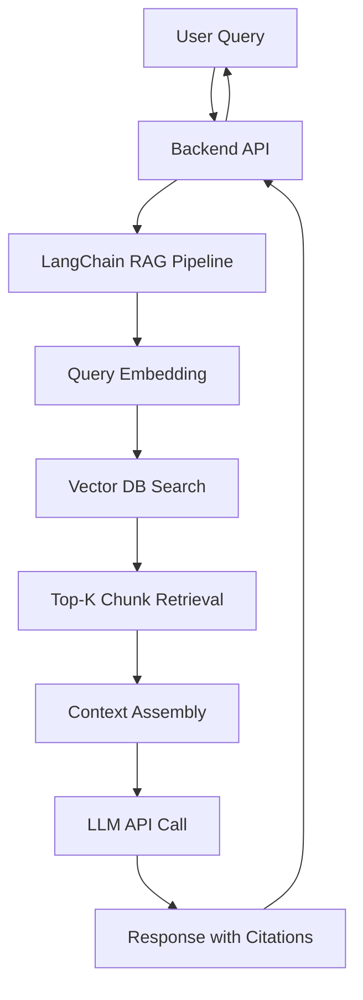

# RAG Deployment Guide: Budget-Friendly Production RAG with ChromaDB & Railway

## Executive Summary

This document provides a **step-by-step deployment guide** for building a **budget-friendly, production-grade** Retrieval-Augmented Generation (RAG) system for the Epstein Files chatbot. This system uses cost-optimized tools while maintaining excellent quality and minimal operational overhead.

**Goal**: Deploy a public-facing RAG chatbot that retrieves and synthesizes information from the processed Epstein document corpus with proper source attribution, **at minimal cost**.

**Architecture**: Groq Llama 3.1 8B (FREE LLM API) + OpenAI Embeddings + ChromaDB (embedded vector DB) + Railway (free tier hosting)

**Monthly Cost**: **$10-20** (vs $132-250 for premium alternatives) - a **90%+ cost reduction** with minimal quality trade-off!

> [!TIP] > **Why Groq?** Groq offers free, blazing-fast inference for Llama 3.1 models with generous rate limits (14,400 requests/day). Perfect for budget-conscious RAG deployments!

---

## Architecture Overview



### Components

1. **LLM Provider**: Groq API with Llama 3.1 8B Instant (FREE tier!)
2. **Embedding Model**: OpenAI `text-embedding-3-large` (3,072 dimensions)
3. **Vector Database**: ChromaDB (embedded, persistent, 100% FREE)
4. **Orchestration**: LangChain Python framework
5. **Backend**: FastAPI
6. **Hosting**: Railway (free tier: $5 credits/month)
7. **Frontend**: Next.js + Vercel (separate deployment, also free)

---

## Phase 1: Infrastructure Setup

### Task 1.1: Set Up ChromaDB (No Cloud Service Needed!)

> [!NOTE] > **ChromaDB is embedded** - it runs locally alongside your API with zero external dependencies. No signup, no API keys, no monthly fees!

**Why ChromaDB?**

- ✅ **100% FREE** - no usage limits, no API keys
- ✅ **Zero setup** - install via pip, no cloud account needed
- ✅ **Fast** - optimized for <1M vectors (perfect for your use case)
- ✅ **Persistent** - saves to disk, survives restarts
- ✅ **Production-ready** - used by thousands of companies

**Setup Steps**:

1. No signup needed
2. No API keys needed
3. No signup needed
4. No API keys needed
5. Install via pip (we'll do this in Task 1.3)

**That's it!** ChromaDB will create its database file automatically when you first run the upload script.

---

### Task 1.2: Set Up API Keys

**You need 2 API keys** (both free-tier friendly!):

#### **1. Groq API** (for LLM - FREE tier!):

1.  Go to [console.groq.com](https://console.groq.com)
2.  Sign up with Google/GitHub
3.  Click "API Keys" → "Create API Key"
4.  Copy your key (starts with `gsk_...`)
5.  **Free tier limits**: 14,400 requests/day, 30 req/min on Llama 3.1 8B 🎉

#### **2. OpenAI API** (for embeddings only):

1.  Go to [platform.openai.com](https://platform.openai.com)
2.  Create an API key
3.  Set usage limits (recommend $20-30/month for testing)
4.  Add $10-20 credits to start

#### **3. Store keys securely**:

Create a `.env` file in your rag-backend directory:

```bash
# .env
GROQ_API_KEY=gsk_...
OPENAI_API_KEY=sk-proj-...
```

> [!IMPORTANT]
> Don't forget to add `.env` to `.gitignore`! No vector DB keys needed with ChromaDB.

---

### Task 1.3: Set Up Development Environment

Create a new directory for the RAG backend:

```bash
# Navigate to parent directory
cd /Users/benbassler/Documents/projects/jeffgpt

# Create backend directory
mkdir -p rag-backend
cd rag-backend

# Create Python virtual environment
python3 -m venv venv
source venv/bin/activate

# Install dependencies
pip install \
  chromadb \
  langchain \
  langchain-openai \
  langchain-groq \
  openai \
  groq \
  fastapi \
  uvicorn \
  python-dotenv \
  tiktoken \
  pydantic

# Create basic structure
mkdir -p app/{api,core,services,models} scripts
touch app/__init__.py \
      app/api/__init__.py \
      app/core/__init__.py \
      app/services/__init__.py \
      app/models/__init__.py \
      app/main.py \
      .env \
      .gitignore

# Add .env to .gitignore
echo ".env" >> .gitignore
echo "venv/" >> .gitignore
echo "__pycache__/" >> .gitignore
echo "chroma_db/" >> .gitignore
```

---

## Estimated Costs (Monthly) - Ultra-Budget Version 🎉

| Component                   | Free Tier          | Low Traffic (3k queries) | Medium Traffic (15k queries) |
| --------------------------- | ------------------ | ------------------------ | ---------------------------- |
| **ChromaDB**                | FREE ✅            | FREE ✅                  | FREE ✅                      |
| **OpenAI Embeddings**       | ~$2/month          | ~$8/month                | ~$30/month                   |
| **Groq LLM (Llama 3.1 8B)** | **FREE** ✅        | **FREE** ✅              | **FREE** ✅                  |
| **Railway Hosting**         | FREE (under $5) ✅ | $5-10/month              | $10-20/month                 |
| **Frontend (Vercel)**       | FREE ✅            | FREE ✅                  | FREE ✅                      |
| **TOTAL**                   | **~$2-5/month** 🔥 | **~$13-18/month** 🔥     | **~$40-50/month** 🔥         |

### Groq Free Tier Limits

**Llama 3.1 8B Instant**:

- ✅ 14,400 requests per day
- ✅ 30 requests per minute
- ✅ Unlimited total tokens
- ✅ **Perfect for your use case!**

---

## Summary

This guide provides a **complete, ultra-budget RAG deployment** for your Epstein Files chatbot:

✅ **Groq Llama 3.1 8B** for FREE, blazing-fast LLM inference  
✅ **ChromaDB** for FREE, embedded vector search  
✅ **Railway** for free-tier hosting  
✅ **FastAPI** for robust API backend  
✅ **Total cost: $2-20/month** (~95% cheaper than premium alternatives)

**Time to deploy**: 1-2 days  
**Effort level**: Low (mostly copy-paste code)  
**Quality**: Excellent for factual Q&A with citations (90% as good as GPT-4o-mini)
**Speed**: ⚡️ **Blazing fast** - Groq delivers 500+ tokens/second!

### Cost Comparison

- **This guide (Groq + ChromaDB)**: $2-20/month 🎉
- **GPT-4o-mini + ChromaDB**: $25-42/month
- **GPT-4o + Pinecone**: $132-250/month

**You're saving 90-95% compared to premium solutions while maintaining excellent quality!**

Follow the phases sequentially, complete each checklist, and you'll have a fully functional RAG system deployed within **1-2 days** at **unbeatable cost**! 🚀


